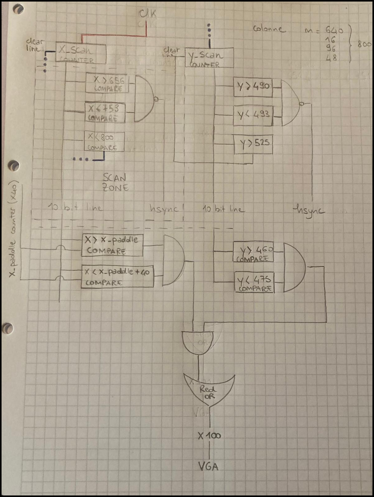
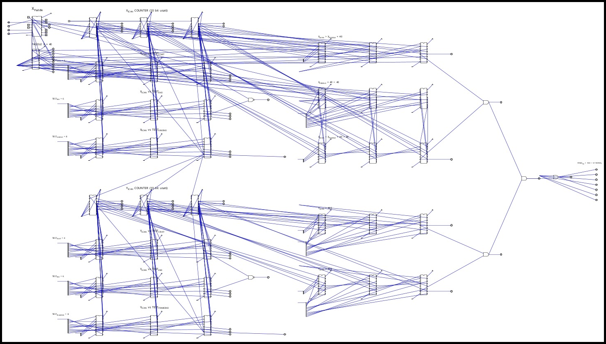
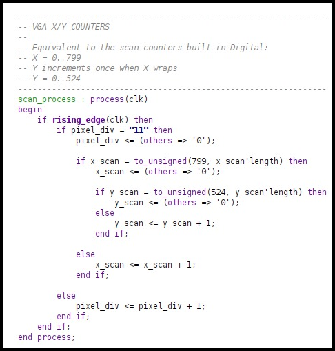
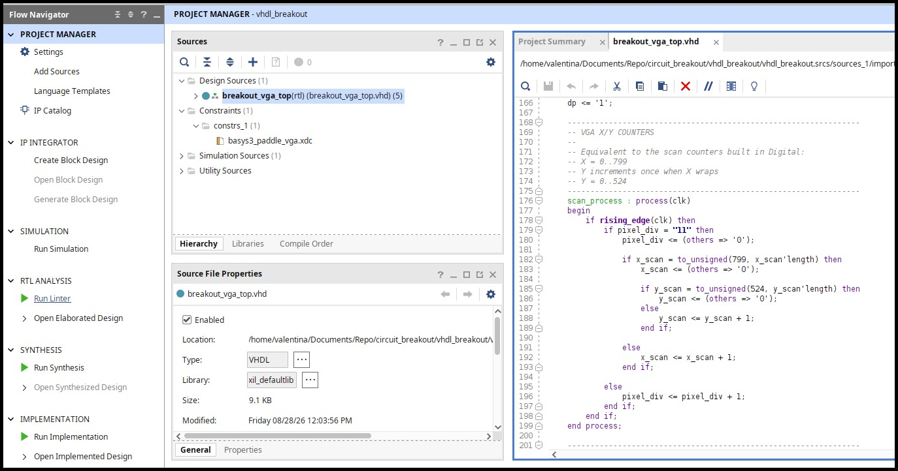
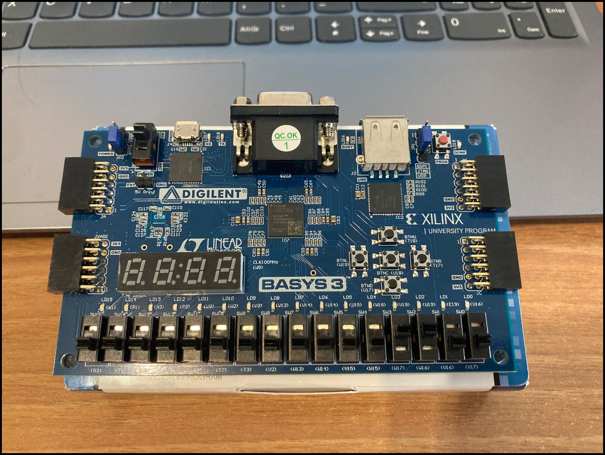

# Programmable Logic Breakout

`Programmable Logic Breakout` is a hands-on FPGA project built around a simple idea: understand a digital system by constructing it step by step, from the first logic sketch to a circuit running on real hardware.

The project uses a **Digilent Basys 3** board with an **AMD/Xilinx Artix-7 FPGA** and develops a Breakout-style video system incrementally. Rather than treating VHDL as ordinary software, each function is first understood as a digital circuit, tested in simulation, translated into VHDL, implemented with Vivado, and finally verified on the FPGA.

The main goal is therefore not only to make the design work, but to understand what happens at every level between an idea on paper and physical programmable logic.

---

## Development approach

Each new functionality follows the same workflow.

### 1. Design the logic on paper

Before writing VHDL, the required behavior is reduced to basic digital logic: counters, comparators, gates, state changes, signal paths, and timing relationships.

Working first with paper and pencil makes the structure explicit. At this stage the question is not *how to write the code*, but rather:

> What digital circuit would implement this function?



The example above develops the VGA scan counters, synchronization conditions, and the first paddle rendering logic before they are expressed in HDL.

### 2. Rebuild and simulate the circuit in Digital

The circuit is then reproduced in **Digital**, an educational digital logic simulator developed by Helmut Neemann:

[Digital — hneemann/digital](https://github.com/hneemann/digital)

This provides an intermediate step between the hand-drawn circuit and VHDL. Counters, comparators, buses, and gates can be connected directly and their behavior can be observed while the circuit is running.



The purpose of this stage is to check the logic itself before asking an HDL synthesizer to interpret it. When something does not behave as expected, the circuit can be inspected at the level at which it was originally conceived.

### 3. Translate the circuit into VHDL

Once the circuit behaves correctly, the same functionality is described in **VHDL**.



This is the transition from a schematic model to a synthesizable hardware description. The intention is to keep a clear relationship between the logic designed in the previous stages and the VHDL that represents it.

For example, a pair of scan counters first drawn and simulated as explicit digital components becomes a clocked VHDL process implementing the same behavior.

### 4. Process the design with Vivado

The VHDL sources and the XDC constraints are loaded into **AMD Vivado**. The design then passes through the FPGA implementation flow:

```text
VHDL + XDC
    ↓
RTL analysis / elaboration
    ↓
Synthesis
    ↓
Implementation
    ↓
Bitstream generation
```



These stages progressively change the representation of the project:

- **RTL analysis and elaboration** check how Vivado interprets the HDL structure;
- **synthesis** maps the design onto FPGA resources such as LUTs, flip-flops, carry logic, and I/O resources;
- **implementation** places those resources on the device and routes the connections between them;
- **bitstream generation** produces the configuration data that can be loaded into the FPGA.

A more detailed step-by-step guide to this part of the workflow is available in [`vivado_user_guide/README.md`](vivado_user_guide/README.md).

### 5. Program the FPGA and test the new function

The generated bitstream is finally loaded onto the **Basys 3**.



The project is tested incrementally: a new function is designed, simulated, implemented, loaded onto the board, and observed before moving on to the next one.

This makes the physical FPGA part of the development process rather than only the final destination. Seeing the actual output provides a direct check of whether the reasoning performed at the previous stages survives the transition to real hardware.

---

## Why this workflow?

FPGA development can easily become a sequence of HDL edits followed by synthesis attempts. This project deliberately uses a slower and more explicit path.

The paper design helps identify the logic. Digital makes that logic observable. VHDL gives it a formal hardware description. Vivado shows how that description is transformed into FPGA resources. The Basys 3 finally shows whether the complete chain works in practice.

The workflow is therefore both a development method and a learning method:

```text
reason → build → simulate → describe → synthesize → implement → test
```

Failures at any stage are useful because they reveal where the mental model and the actual circuit differ.

---

## Current hardware and tools

| Component | Use in the project |
|---|---|
| **Digilent Basys 3** | FPGA development board |
| **AMD/Xilinx Artix-7 XC7A35T** | Target FPGA |
| **Digital** | Gate-level circuit design and simulation |
| **VHDL** | Hardware description language |
| **AMD Vivado** | RTL analysis, synthesis, implementation, bitstream generation and FPGA programming |
| **VGA output** | Direct visual output used to test the video logic |

---

## Project structure

The repository is kept intentionally simple. The important files are the handwritten design sources and documentation; automatically generated build material should generally stay outside version control when it can be recreated.

```text
circuit_breakout/
├── src/                  # VHDL sources and project logic
├── vivado_user_guide/    # Step-by-step Vivado guide
├── docs/
│   └── images/           # README and documentation images
├── .gitignore
├── LICENSE
└── README.md
```

Local experiments and temporary simulation material can be kept in an ignored directory such as `prove/` without becoming part of the remote repository.

---

## FPGA implementation path

One useful way to summarize the project is to follow the same functionality through its different representations:

```text
Logical idea
    ↓
Hand-drawn circuit
    ↓
Digital schematic and simulation
    ↓
VHDL RTL description
    ↓
Synthesized FPGA netlist
    ↓
Placed and routed Artix-7 resources
    ↓
Bitstream
    ↓
Working circuit on the Basys 3
```

The circuit changes representation several times, but it is still the same logical function. Understanding those transformations is one of the central aims of the project.

---

## License

This repository is distributed under the **GNU General Public License v3.0**. See [`LICENSE`](LICENSE) for details.
