# Guida pratica a Vivado: da VHDL alla programmazione della FPGA

Questa guida descrive il flusso completo in **AMD Vivado** per creare un progetto RTL, caricare file **VHDL** e **constraints XDC**, controllare il progetto con l'analisi RTL, eseguire **sintesi** e **implementazione**, generare il **bitstream** e infine programmare una FPGA.

Gli screenshot usati qui provengono da un progetto per **Digilent Basys 3**, basata su FPGA **Xilinx/AMD Artix-7 XC7A35T-1CPG236C** (`xc7a35tcpg236-1`).

> **Idea generale del flusso**
>
> `VHDL + XDC` → `RTL / Elaborazione` → `Sintesi` → `Implementazione` → `Bitstream` → `Programmazione FPGA`

---

## Indice

1. [Creare un nuovo progetto](#1-creare-un-nuovo-progetto)
2. [Scegliere la scheda o il dispositivo FPGA](#2-scegliere-la-scheda-o-il-dispositivo-fpga)
3. [Aggiungere i file VHDL](#3-aggiungere-i-file-vhdl)
4. [Aggiungere il file di constraints XDC](#4-aggiungere-il-file-di-constraints-xdc)
5. [Controllare il Top Level](#5-controllare-il-top-level)
6. [Analisi RTL ed Elaborated Design](#6-analisi-rtl-ed-elaborated-design)
7. [Sintesi](#7-sintesi)
8. [Implementazione](#8-implementazione)
9. [Generazione del bitstream](#9-generazione-del-bitstream)
10. [Programmazione della FPGA](#10-programmazione-della-fpga)
11. [Che cosa rappresentano le varie fasi](#11-che-cosa-rappresentano-le-varie-fasi)
12. [Controlli utili prima di programmare](#12-controlli-utili-prima-di-programmare)

---

# 1. Creare un nuovo progetto

Aprire Vivado e scegliere **Create Project** / **New Project**.

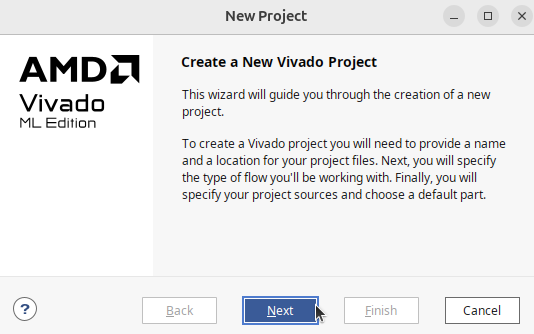

Assegnare al progetto un nome e scegliere la cartella in cui salvarlo. È comodo lasciare selezionata l'opzione **Create project subdirectory**, in modo che Vivado crei una sottocartella dedicata.

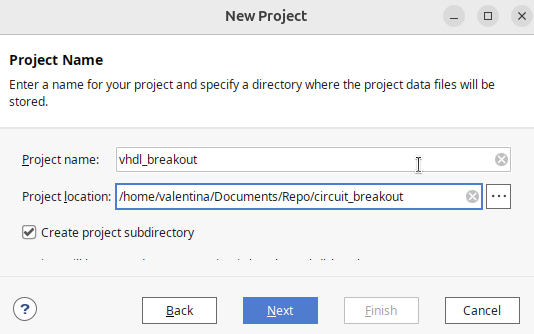

Premere **Next**.

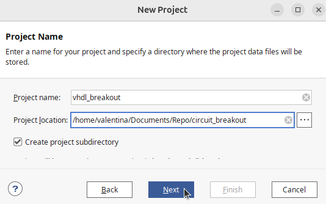

Come tipo di progetto scegliere **RTL Project**.

Se i sorgenti verranno aggiunti successivamente, è possibile selezionare:

- **Do not specify sources at this time**

In questo modo si crea prima il contenitore del progetto e si aggiungono VHDL e constraints in un secondo momento.

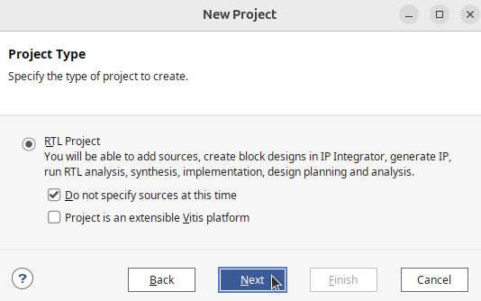

---

# 2. Scegliere la scheda o il dispositivo FPGA

Nella schermata **Default Part** si può scegliere direttamente la scheda, se Vivado possiede i relativi board files.

Per Basys 3:

- scheda: **Basys3**
- FPGA: **XC7A35T**
- package: **CPG236**
- speed grade: **-1**
- part completo: `xc7a35tcpg236-1`

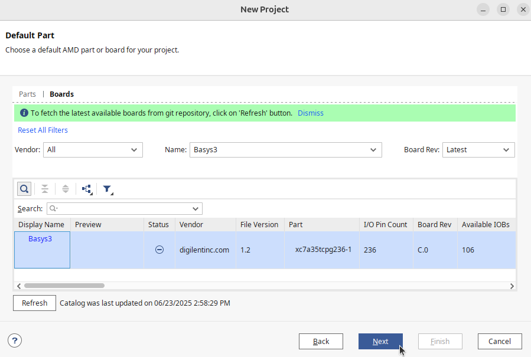

Se la Basys 3 non compare nella scheda **Boards**, è possibile selezionare direttamente il componente equivalente nella scheda **Parts**.

Alla fine Vivado mostra un riepilogo del progetto. Controllare soprattutto che **Board** e **Part** siano corretti, quindi premere **Finish**.

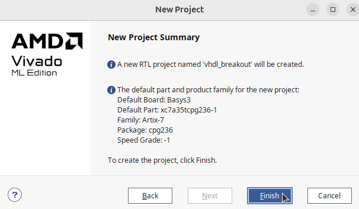

---

# 3. Aggiungere i file VHDL

Dal pannello **Sources** premere il pulsante **+** oppure usare **Add Sources** dal Flow Navigator.

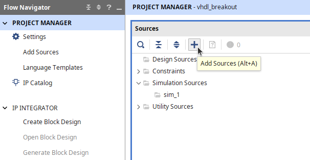

Scegliere:

**Add or create design sources**

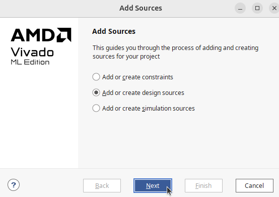

Nella schermata successiva premere **Add Files**.

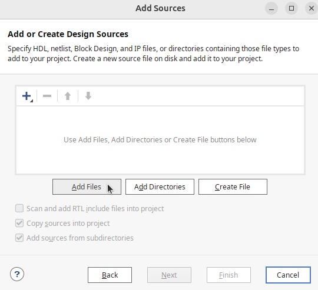

Selezionare tutti i file `.vhd` necessari al progetto.

Nell'esempio sono presenti:

- `breakout_vga_top.vhd`
- `button_onepulse.vhd`
- `counter_74193_style.vhd`
- `sevenseg_hex.vhd`

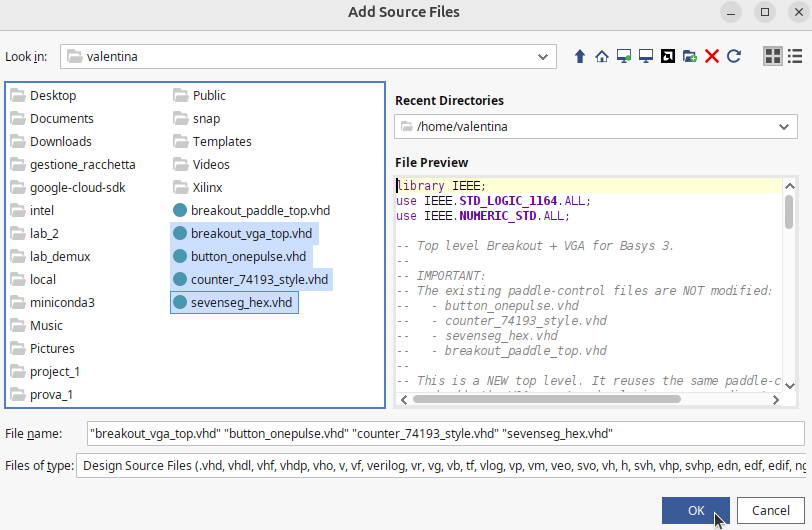

Dopo averli aggiunti, Vivado mostra l'elenco dei sorgenti che entreranno nel progetto.

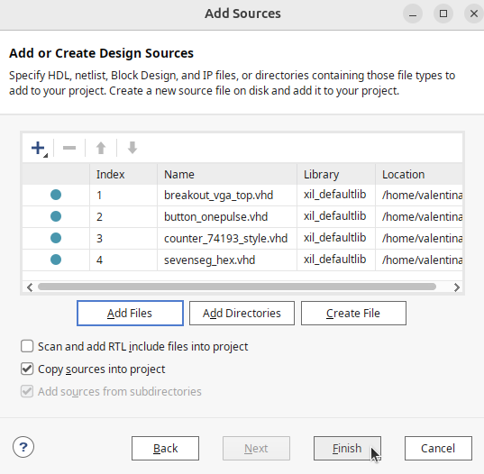

### Copiare o referenziare i file?

L'opzione **Copy sources into project** crea una copia dei file dentro la struttura del progetto Vivado.

- **Se attiva:** il progetto Vivado possiede una propria copia dei sorgenti.
- **Se disattiva:** Vivado usa i file nella loro posizione originale.

Per un repository Git in cui i file VHDL sono già organizzati in una cartella `src/`, spesso è preferibile **non duplicarli** e mantenere una sola copia sorgente. L'importante è sapere quale delle due strategie si sta usando.

---

# 4. Aggiungere il file di constraints XDC

I file VHDL descrivono la **logica** del circuito. Il file `.xdc` descrive invece i **vincoli fisici e temporali** del progetto.

Per aggiungerlo usare nuovamente **Add Sources**, ma questa volta selezionare:

**Add or create constraints**

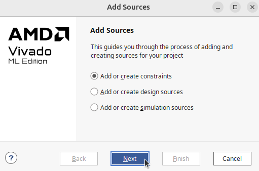

Poi aggiungere il file `.xdc` con **Add Files**.

Per una Basys 3 il file XDC viene normalmente usato per specificare, per esempio:

- quale porta VHDL va su quale **pin fisico** della FPGA;
- lo standard elettrico, ad esempio `LVCMOS33`;
- il pin del clock;
- eventuali vincoli di timing del clock;
- i pin associati a VGA, pulsanti, switch, LED, display a 7 segmenti, ecc.

Esempio concettuale:

```tcl
set_property PACKAGE_PIN W5 [get_ports clk]
set_property IOSTANDARD LVCMOS33 [get_ports clk]
create_clock -period 10.000 [get_ports clk]
```

Il nome dentro `get_ports`, per esempio `clk`, deve corrispondere **esattamente** al nome della porta dichiarata nell'entity VHDL di livello superiore.

> **Importante:** il VHDL dice *che cosa deve fare il circuito*; l'XDC dice *come collegare quel circuito alla FPGA e alla scheda reale*.

---

# 5. Controllare il Top Level

Vivado deve sapere quale entity VHDL rappresenta il circuito completo da sintetizzare.

Nel progetto di esempio il top level è:

```text
breakout_vga_top
```

Normalmente Vivado lo riconosce automaticamente. Se non lo fa:

1. aprire **Sources → Design Sources**;
2. fare clic destro sul file/entity principale;
3. scegliere **Set as Top**.

Tutti gli altri moduli VHDL diventano componenti istanziati sotto il Top Level.

---

# 6. Analisi RTL ed Elaborated Design

Prima della sintesi conviene controllare la descrizione RTL.

Nel Flow Navigator è disponibile la sezione **RTL ANALYSIS**.

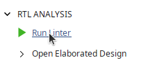

## Run Linter

Il **linter** individua possibili problemi nel codice HDL, per esempio:

- costrutti sospetti;
- segnali inutilizzati;
- larghezze incompatibili;
- assegnazioni problematiche;
- alcune situazioni che potrebbero produrre hardware diverso da quello previsto.

Un warning non è necessariamente un errore, ma va letto e capito.

## Open Elaborated Design

L'**Elaborated Design** mostra come Vivado interpreta la gerarchia e le connessioni descritte dal VHDL **prima della vera sintesi tecnologica**.

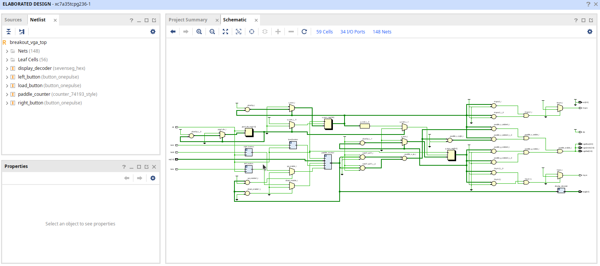

Qui è possibile controllare:

- entity e componenti istanziati;
- porte di ingresso/uscita;
- bus;
- mux;
- registri e contatori riconosciuti;
- connessioni tra i blocchi;
- struttura gerarchica.

Questa fase risponde alla domanda:

> **“Vivado ha capito il mio VHDL nel modo in cui intendevo io?”**

L'Elaborated Design **non è ancora il circuito fisicamente piazzato sulla FPGA**.

---

# 7. Sintesi

Quando la struttura RTL è corretta, eseguire:

**SYNTHESIS → Run Synthesis**

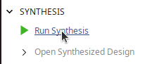

La sintesi trasforma la descrizione VHDL in una **netlist tecnologica** compatibile con la FPGA scelta.

In questa fase Vivado decide come realizzare la logica usando risorse come:

- LUT;
- flip-flop;
- carry chain;
- multiplexer dedicati;
- block RAM, se necessarie;
- DSP, se necessari;
- buffer di I/O;
- altre primitive disponibili nell'Artix-7.

Dopo la sintesi aprire **Open Synthesized Design**.

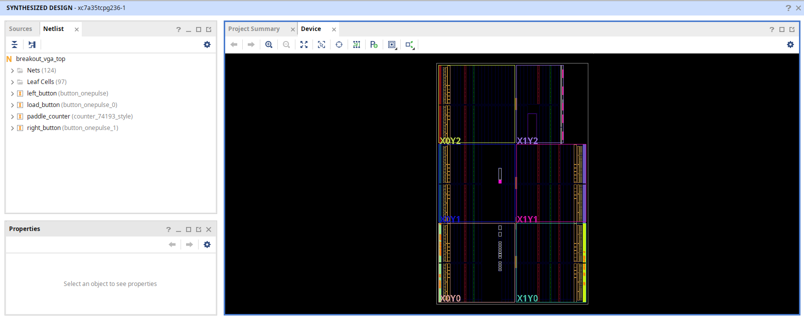

A questo punto il progetto è già stato tradotto in risorse realizzabili sulla FPGA, ma **non sono ancora state decise definitivamente le loro posizioni e le connessioni fisiche di routing**.

È utile controllare:

- **Utilization Report**;
- eventuali warning;
- numero di LUT e flip-flop utilizzati;
- clock riconosciuti;
- porte di I/O;
- schematic della netlist sintetizzata.

---

# 8. Implementazione

Dopo la sintesi eseguire:

**IMPLEMENTATION → Run Implementation**

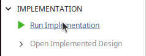

L'implementazione comprende, in modo semplificato:

1. ottimizzazione della netlist;
2. **placement**: scelta delle risorse fisiche della FPGA;
3. **routing**: scelta delle interconnessioni fisiche tra quelle risorse;
4. verifica dei vincoli temporali e fisici.

Dopo il completamento aprire **Open Implemented Design**.

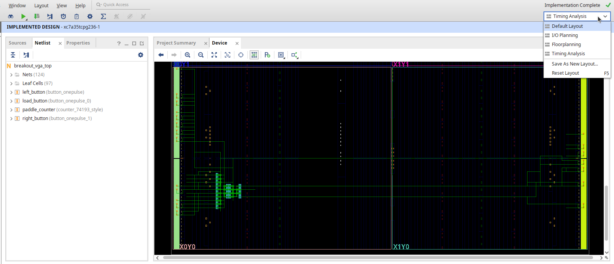

Questa vista è molto diversa dall'Elaborated Design: qui si osserva il progetto **effettivamente collocato e instradato nel dispositivo FPGA**.

Le linee di routing e le risorse evidenziate mostrano dove Vivado ha realmente collocato la logica.

### Timing

Dopo l'implementazione è importante controllare il **Timing Summary / Timing Analysis**.

In particolare verificare che non ci siano violazioni dei vincoli di timing. In un progetto sincrono la domanda fondamentale è:

> **“Il circuito riesce a completare tutte le operazioni tra un fronte di clock e il successivo?”**

Se il progetto ha `WNS >= 0` e non presenta altre violazioni rilevanti, il timing principale è rispettato.

---

# 9. Generazione del bitstream

Quando l'implementazione è terminata correttamente, usare:

**PROGRAM AND DEBUG → Generate Bitstream**

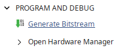

Il **bitstream** è il file binario che contiene i dati necessari a configurare le risorse programmabili della FPGA secondo il circuito implementato.

Per un progetto con top level `breakout_vga_top`, il file avrà normalmente un nome simile a:

```text
breakout_vga_top.bit
```

Vivado lo salva normalmente all'interno della directory del progetto, nella run di implementazione, per esempio:

```text
<progetto>.runs/impl_1/breakout_vga_top.bit
```

Non è necessario copiare manualmente il file per programmare la scheda: Hardware Manager può usare direttamente quello generato dal progetto.

---

# 10. Programmazione della FPGA

Dopo aver generato il bitstream:

1. collegare la **Basys 3** al computer tramite USB;
2. accendere la scheda;
3. in Vivado aprire **PROGRAM AND DEBUG → Open Hardware Manager**;
4. scegliere **Open Target → Auto Connect**;
5. Vivado dovrebbe rilevare il dispositivo Artix-7 della scheda;
6. selezionare il dispositivo, normalmente qualcosa come `xc7a35t_0`;
7. scegliere **Program Device**;
8. verificare che sia selezionato il file `.bit` corretto;
9. premere **Program**.

Dopo pochi secondi la FPGA viene configurata e il circuito entra in funzione.

## Attenzione: la configurazione è volatile

La programmazione tramite file `.bit` configura direttamente la SRAM interna della FPGA. Se si spegne la Basys 3, la configurazione viene persa.

Per un uso normale durante lo sviluppo questo è esattamente ciò che si vuole. Per fare in modo che il progetto venga caricato automaticamente all'accensione è invece necessario programmare la **memoria di configurazione non volatile** presente sulla scheda; è una procedura separata.

---

# 11. Che cosa rappresentano le varie fasi

| Fase | Domanda a cui risponde | Risultato |
|---|---|---|
| **VHDL** | Che comportamento logico voglio? | Descrizione RTL |
| **XDC** | A quali pin e con quali vincoli deve essere collegato? | Vincoli fisici/timing |
| **Elaborazione RTL** | Vivado ha interpretato correttamente gerarchia e connessioni? | Circuito logico elaborato |
| **Sintesi** | Con quali risorse FPGA posso realizzarlo? | Netlist tecnologica |
| **Implementazione** | Dove metto fisicamente quelle risorse e come le collego? | Design placed & routed |
| **Bitstream** | Come configuro realmente la matrice programmabile? | File `.bit` |
| **Program Device** | Come trasferisco la configurazione sulla scheda? | FPGA configurata |

In forma ancora più compatta:

```text
VHDL
  ↓
Elaborazione RTL
  ↓
Sintesi
  ↓
LUT / FF / carry / I/O / altre risorse FPGA
  ↓
Placement + Routing
  ↓
Bitstream
  ↓
FPGA reale
```

---

# 12. Controlli utili prima di programmare

Prima di generare il bitstream conviene verificare almeno questi punti:

- il **Top Level** è quello corretto;
- non ci sono errori nel VHDL;
- i warning della sintesi sono stati letti e compresi;
- tutte le porte esterne necessarie sono presenti nel file XDC;
- i nomi in `get_ports` corrispondono alle porte del Top Level;
- i pin assegnati sono quelli corretti per la scheda;
- gli `IOSTANDARD` sono corretti;
- il clock possiede un vincolo temporale appropriato;
- la sintesi è completata senza errori;
- l'implementazione è completata senza errori;
- il timing è rispettato;
- non esistono porte I/O non vincolate che Vivado considera critiche.

---

## Nota pratica sul progetto Basys 3

Nel caso della Basys 3, il file VHDL rimane in larga parte indipendente dal package fisico della FPGA. È il file **XDC** a fare il collegamento tra i nomi logici del Top Level e i pin reali della scheda.

Per esempio, un'uscita VHDL come:

```vhdl
VGA_R : out std_logic_vector(3 downto 0)
```

non “sa” da sola a quali piedini della FPGA sia collegata. Saranno le righe XDC a collegare `VGA_R(0)`, `VGA_R(1)`, ecc. ai package pin che sulla Basys 3 arrivano alla rete resistiva e quindi al connettore VGA.

Questo separa bene due livelli:

- **VHDL:** progetto logico;
- **XDC:** collegamento tra progetto logico e hardware concreto della board.

---

## Struttura consigliata del repository

Per mantenere separati i sorgenti dai file generati automaticamente da Vivado, una struttura semplice può essere:

```text
circuit_breakout/
├── README.md
├── src/
│   ├── breakout_vga_top.vhd
│   ├── button_onepulse.vhd
│   ├── counter_74193_style.vhd
│   └── sevenseg_hex.vhd
├── constraints/
│   └── basys3.xdc
├── docs/
│   └── images/
└── vivado/
    └── vhdl_breakout/       # progetto Vivado e file generati
```

In un repository Git è normalmente utile conservare con particolare attenzione i **sorgenti VHDL**, i **constraints XDC** e l'eventuale script di creazione del progetto, mentre molti file temporanei e risultati intermedi generati da Vivado possono essere esclusi tramite `.gitignore`.

---

**Scheda usata negli screenshot:** Digilent Basys 3 — AMD/Xilinx Artix-7 `xc7a35tcpg236-1`.
